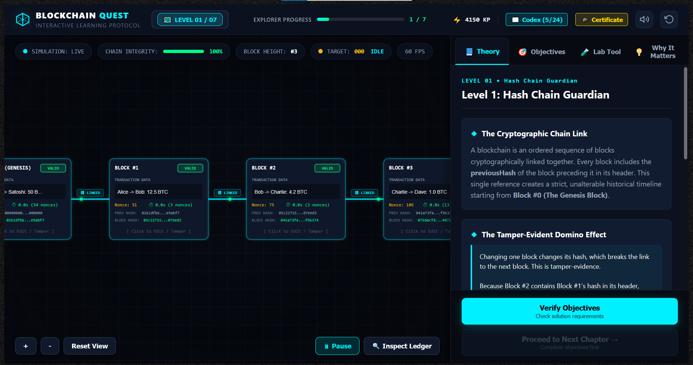

# Blockchain Quest

An interactive 7-level web game that teaches blockchain fundamentals — hashing, Proof of Work, Proof of Stake, P2P broadcast, attack scenarios, forks, and Merkle trees — through hands-on simulation.



## 🎮 How to Play

### Step 1 — Install Node.js (one-time setup)
Download from [https://nodejs.org](https://nodejs.org)  
Choose the LTS version. Install with all defaults. Done — you never have to touch this again.

### Step 2 — Get the game
**Option A (no git required):**
1. Click the green **Code** button on this page
2. Click **Download ZIP**
3. Extract the ZIP to any folder

**Option B (if you use git):**
```bash
git clone https://github.com/UsmanNizamani/blockchain-quest.git
cd blockchain-quest
```

### Step 3 — Launch
- **Windows:** Double-click `Launch Game.bat`
- **macOS:** Double-click `Launch Game.command`
- **Linux:** Double-click `Launch Game.sh` (or run `./Launch Game.sh` in a terminal)

A window opens, the game opens automatically in your browser at [http://localhost:3000](http://localhost:3000), and you're playing.

### Step 4 — To stop the game
Close the terminal window (Windows) or press Ctrl+C (macOS/Linux). The server stops.

---

## 📚 What You'll Learn

| Level | Topic | Key Concepts Explored |
| :---: | :--- | :--- |
| **1** | **Hash Chain Guardian** | SHA-256, avalanche effect, hash pointers, genesis block, and tamper detection |
| **2** | **PoW Miner & PoS Staking** | Mining loops, nonces, dynamic difficulty adjustment, validators, and slot attestations |
| **3** | **Sovereign Wallet & Cryptography** | Keypair generation, public addressing, ECDSA signatures, nonces, and UTXO/account models |
| **4** | **P2P Gossip Network Simulator** | Peer topology, transaction broadcast, node verification, mempools, and Byzantine fault tolerance |
| **5** | **Security Defender & Attack Scenarios** | 51% hashrate reorgs, double-spending, nothing-at-stake, and long-range history attacks |
| **6** | **Forks, Finality & The Merge** | Soft forks vs hard forks (BTC vs BCH, ETH vs ETC), Casper FFG checkpoints, and Ethereum Merge |
| **7** | **Merkle Trees & State Proofs** | Pairwise hashing, Merkle roots, $O(\log N)$ inclusion proofs, forgery rejection, and SPV light clients |

---

## 🖥️ Requirements

- **Node.js 16 or newer** (one-time install, ~30 seconds)  
  Download: [https://nodejs.org](https://nodejs.org)
- **Any modern browser:** Chrome 90+, Firefox 88+, Safari 14+, Edge 90+
- **~10 MB disk space**

That's it. No Python, no Docker, no database. Zero external dependencies.

---

## 🛠️ For Developers

### Project Structure
```text
blockchain-quest/
├── index.html              # Main application entry point
├── server.js               # Node.js local dev HTTP server (port 3000)
├── package.json            # Project manifest & npm scripts
├── Launch Game.bat         # Windows one-click launcher
├── Launch Game.command     # macOS launcher
├── Launch Game.sh          # Linux launcher
├── START_HERE.txt          # Plain-text quick start guide
├── TROUBLESHOOTING.md      # Comprehensive issue resolution guide
├── LICENSE                 # MIT License
├── css/                    # Modular stylesheets (main, canvas, sidebar)
├── js/                     # Game source
│   ├── blockchain/         # Pure cryptographic simulation models
│   ├── core/               # EventBus, GameState, persistence
│   ├── education/          # Educational curriculum, summaries, codex, quizzes
│   ├── engine/             # Canvas rendering engine & particle effects
│   ├── levels/             # Level 1 to Level 7 mission controllers
│   └── ui/                 # UI components, modals, toasts
├── tests.html              # Comprehensive automated regression test suite
└── screenshots/            # Screenshots directory (see screenshots/README.md)
```

### Development Commands
```bash
# Start dev server locally at http://localhost:3000
npm start

# Development mode with auto-reload
npm run dev
```

### Running Tests
Open [http://localhost:3000/tests.html](http://localhost:3000/tests.html) in your browser to run the 63+ automated regression tests across all wallet, node, attack simulator, and Merkle tree modules.

### Manual Run Without Launcher
```bash
node server.js
# Then open http://localhost:3000 in your browser
```

---

## 🐛 Troubleshooting

For detailed walkthroughs and diagnostic steps, see [TROUBLESHOOTING.md](TROUBLESHOOTING.md).

### "Node.js is not recognized" / "node: command not found"
Node.js is not installed, or your terminal can't find it. Two fixes:
1. Install from [https://nodejs.org](https://nodejs.org) (LTS version), then reopen the launcher.
2. On Windows, make sure "Add to PATH" was checked during Node install (it is by default).

### "Port 3000 is already in use"
Another program is using port 3000, OR a previous Blockchain Quest server is still running.

**Fix (Windows):**
1. Open Command Prompt
2. Run: `netstat -ano | findstr :3000`
3. Note the PID (last column)
4. Run: `taskkill /PID <PID> /F`

**Fix (macOS/Linux):**  
Run: `lsof -ti:3000 | xargs kill -9`

Or simply restart your computer. The port will be free.

### The browser opens but shows "Cannot reach this site"
The server didn't start in time, or crashed. Look at the terminal window for red error text. Common causes:
- Node.js not installed → see first item
- Port 3000 blocked → see second item
- Corrupted download → re-download the ZIP

### The browser never opens automatically
Manually open your browser and go to: [http://localhost:3000](http://localhost:3000)

### Windows SmartScreen warning on the .bat file
Click **More info** → **Run anyway**. The `.bat` file only starts a local server on your machine; you can inspect it in any text editor.

### Antivirus flags the launcher
Some antivirus tools flag `.bat` files that run taskkill. The launcher is safe and open source. Inspect it if you're unsure — it's 40 lines of plain text.

### Progress isn't saved
The game saves progress in browser `localStorage`. Make sure:
- You're not using private/incognito mode
- `localStorage` is enabled in your browser settings
- You're accessing the game at `http://localhost:3000` (not a `file://` URL)

### I want to run it without the launcher
Open a terminal in the project folder and run:
```bash
node server.js
```
Then open [http://localhost:3000](http://localhost:3000).

### The game loads but nothing is playable
You may have opened `index.html` directly by double-clicking it. This does NOT work — the game needs to be served by the local Node server. Always launch via the launcher script (or `node server.js`).

---

## 🤝 Contributing

Issues and pull requests are welcome!
1. Fork the repository
2. Create a descriptive feature branch (`git checkout -b feature/my-feature`)
3. Test changes using `npm start` and `http://localhost:3000/tests.html`
4. Commit your changes (`git commit -m "Add feature"`)
5. Push to your branch and submit a Pull Request

---

## 📜 License

This project is licensed under the MIT License — see the [LICENSE](LICENSE) file for details.

---

## 🙏 Credits

- Built with standard HTML5, CSS3, and modern JavaScript.
- Zero third-party runtime dependencies.
- Local server: Node.js standard library (`http`, `fs`, `path`).

⭐ **Enjoying Blockchain Quest? Star the repository on GitHub!**
